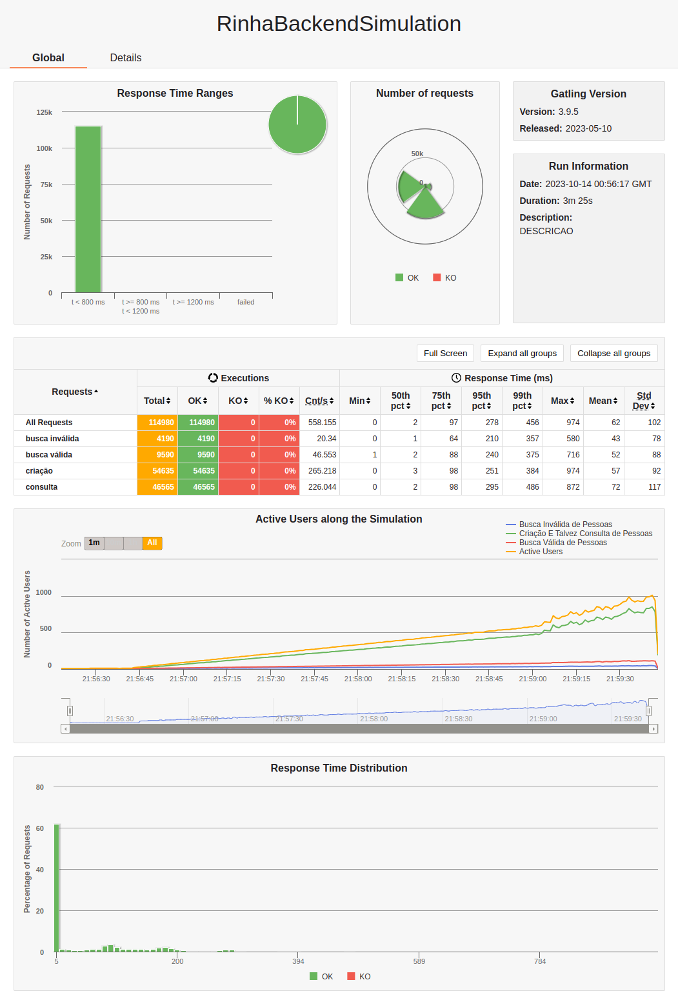
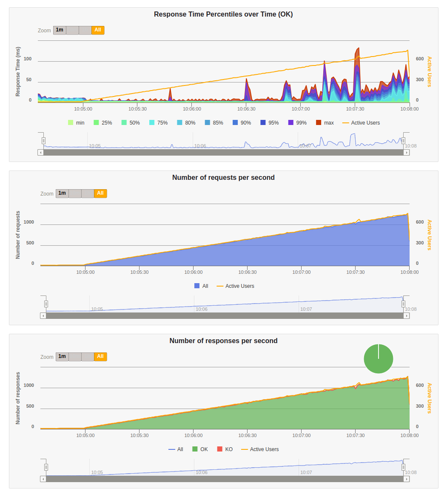
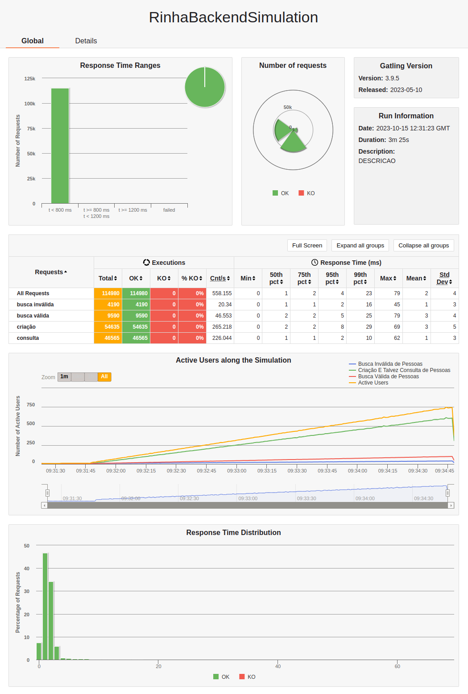
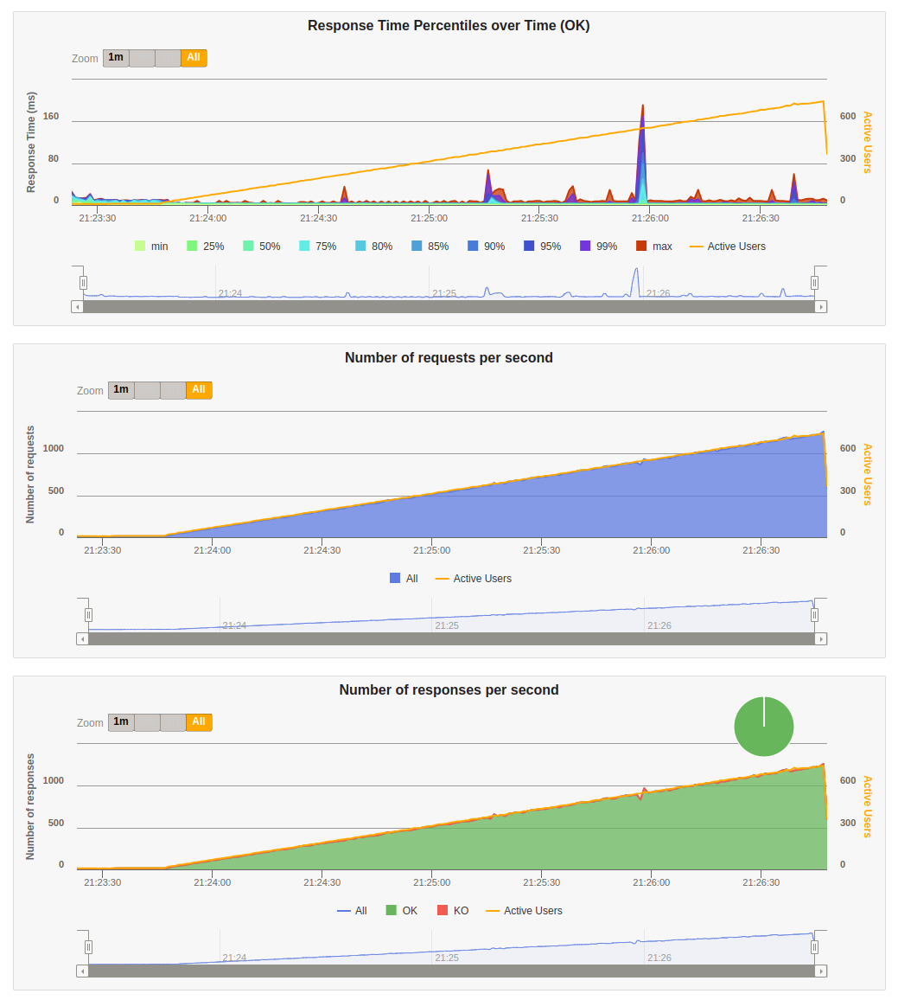

# Rinha de backend

Implementação em elixir da [rinha de backend 2023 Q3](https://github.com/zanfranceschi/rinha-de-backend-2023-q3)

## Objetivo

Um dos objetivos era criar uma aplicação em elixir que fosse capaz de fazer tudo que os outros projetos já fizeram, mas sem quebrar muito a estrutura da aplicação, como por exemplo batch insert.

O outro objetivo era poder testar a capacidade de escalar verticalmente do elixir.

## Implementações testadas

1. `network_mode: host` no docker-compose.yml
    - isso é uma das coisas mais importantes por causa do bottleneck interno do docker compose, mas mesmo assim, dependendo da implementação, mudar isso não vai garantir 46K e zero KOs
2. cache da api de consulta e se um apelido já existe no banco
    - pouca diferença, mas se vc está perto de 44K inserts, pode até ser a diferença entre isso e os 46K
3. cache distribuido entre as aplicações
    - assim como o outro cache, não fazia muita diferença, e as vezes o trabalho de replicar/particionar o cache quebrava algo
4. connexões de worker do nginx
    - reduzir das milhares até as centenas
    - evita que muitas requisições passem para a aplicação caso ela não seja capaz de responder tudo
    - pouca difereça, mas se vc está perto de 44K inserts, pode até ser a diferença entre isso e os 46K
5. connexões do pool do banco
    - reduzir das centenas até as dezenas (30 conexões já parecem ser o suficiente)
    - mesmo coiceito das conexões do nginx
    - pouca difereça, mas se vc está perto de 44K inserts, pode até ser a diferença entre isso e os 46K
6. adicionar batch insert
    - não testei isso, mas muitas outras pessoas implementaram
    - essa implementação reduz o load do banco ao inserir vários registros ao mesmo tempo assincronamente
    - mas o problema é que pra realizar isso assincronamente, é necessário fazer algum tipo de "gambiarra" para que o `GET /pessoas/[:id]` funcione corretamente e retorne algo, como cachear o payload e gerar o UUID dentro da aplicação
7. adicionar um campo só para busca e um index GIN
    - alguma diferença, permitiu sair dos 20K para a casa dos 30K, mas o index GIN não parece ser o melhor
8. adicionar um campo só para busca e um index GIST
    - bastante diferença, permitiu sair dos 20K para a casa dos 40K, resultado bem superior ao GIN
    - nesse cenário, o banco com 1 CPU inteira, ficava sempre nos 100%, e caso a aplicação não tivesse com certas otimizações, como cache ou não usar Nginx, haviam _runs_ que ainda ocorriam KOs e não chegava nos 46K
9. adicionar um campo só para busca e um index GIST com siglen em valores acima de 128 bytes
    - santo graal
    - 46K sem KO em todos os cenários, sem cache, com cache, com nginx, sem nginx, indiferente do db pool etc.
    - CPU do banco não passa de 50% de 1 CPU, mesmo na parte mais pesada do teste
    - também permitiu chegar em 100% das requisições abaixo dos 800ms
    - [testes que eu fiz sobre vários valores diferentes do siglen](./SIGLEN.md)
    - [link com o valor certo](https://www.postgresql.org/docs/16/pgtrgm.html#PGTRGM-INDEX) - o default é 12 bytes
    - [link com o valor errado](https://www.postgresql.org/docs/16/textsearch-indexes.html) - por alguma razão, aqui fala q é 124 bytes

## Conclusões

O maior bottleneck de toda a rinha foi a API `GET /pessoas?t=[:termo da busca]`, ao adicionar um campo e um index GIST con siglen de 1024 e tendo uma aplicação com concorrência o suficiente, já resolve boa parte do problema, fazendo que seja aparentemente desnecessário qualquer outro tipo de otimização agressiva para conseguir os 46K de registros e zero KOs.

## Resultados

### Duas instâncias (com nginx)

#### Resultado do gatling navegador




#### Resultado do gatling console

```
Simulation RinhaBackendSimulation completed in 205 seconds
Parsing log file(s)...
Parsing log file(s) done
Generating reports...

================================================================================
---- Global Information --------------------------------------------------------
> request count                                     114980 (OK=114980 KO=0     )
> min response time                                      0 (OK=0      KO=-     )
> max response time                                    133 (OK=133    KO=-     )
> mean response time                                     5 (OK=5      KO=-     )
> std deviation                                         10 (OK=10     KO=-     )
> response time 50th percentile                          2 (OK=2      KO=-     )
> response time 75th percentile                          3 (OK=3      KO=-     )
> response time 95th percentile                         28 (OK=28     KO=-     )
> response time 99th percentile                         53 (OK=53     KO=-     )
> mean requests/sec                                558.155 (OK=558.155 KO=-     )
---- Response Time Distribution ------------------------------------------------
> t < 800 ms                                        114980 (100%)
> 800 ms <= t < 1200 ms                                  0 (  0%)
> t >= 1200 ms                                           0 (  0%)
> failed                                                 0 (  0%)
================================================================================
A contagem de pessoas é: 46565
```

#### Recusos do docker durante a parte mais pesada do teste


### Uma instância (sem nginx)

#### Resultado do gatling navegador




#### Resultado do gatling console

```
Simulation RinhaBackendSimulation completed in 205 seconds
Parsing log file(s)...
Parsing log file(s) done
Generating reports...

================================================================================
---- Global Information --------------------------------------------------------
> request count                                     114980 (OK=114980 KO=0     )
> min response time                                      0 (OK=0      KO=-     )
> max response time                                     79 (OK=79     KO=-     )
> mean response time                                     2 (OK=2      KO=-     )
> std deviation                                          4 (OK=4      KO=-     )
> response time 50th percentile                          1 (OK=1      KO=-     )
> response time 75th percentile                          2 (OK=2      KO=-     )
> response time 95th percentile                          4 (OK=4      KO=-     )
> response time 99th percentile                         23 (OK=23     KO=-     )
> mean requests/sec                                558.155 (OK=558.155 KO=-     )
---- Response Time Distribution ------------------------------------------------
> t < 800 ms                                        114980 (100%)
> 800 ms <= t < 1200 ms                                  0 (  0%)
> t >= 1200 ms                                           0 (  0%)
> failed                                                 0 (  0%)
================================================================================
A contagem de pessoas é: 46565
```

#### Recusos do docker durante a parte mais pesada do teste


