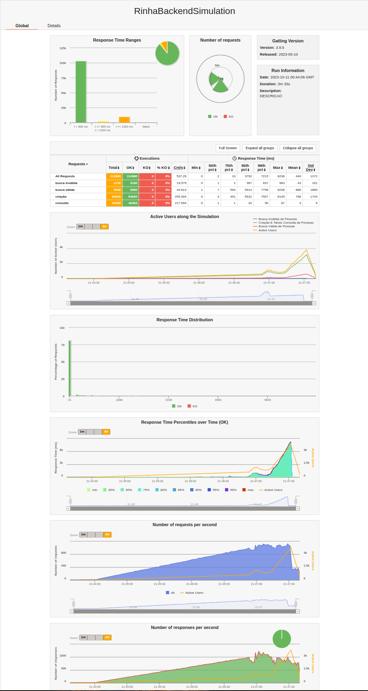
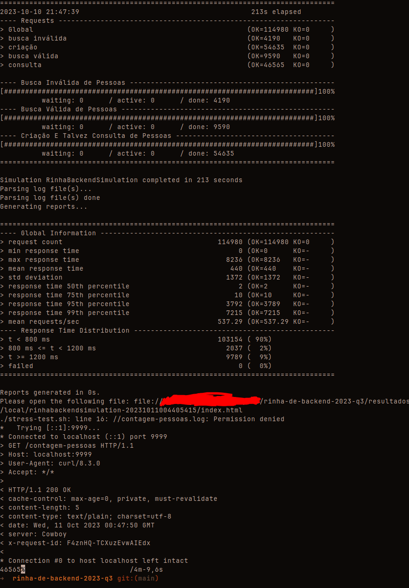
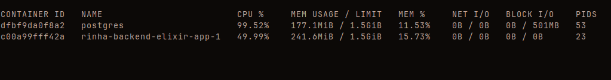

# Rinha de backends

Repo original da competição: https://github.com/zanfranceschi/rinha-de-backend-2023-q3

## Objetivo

O objetivo era criar uma apliação que fosse capaz de fazer tudo que os outros projetos já fizeram, mas SEM algumas das principais otimizações utilizadas:

- nginx
- multiplos serviços (apenas um app)
- sem batch insert

## Prints

### Resultado do gatling

### Resultado do gatling no console

### Recusos do docker durante a parte mais pesada do teste

